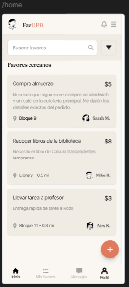
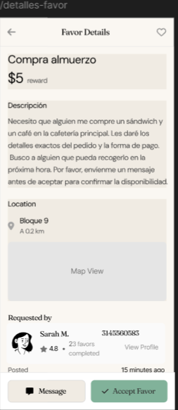
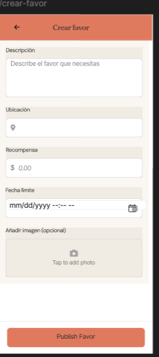
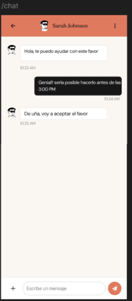
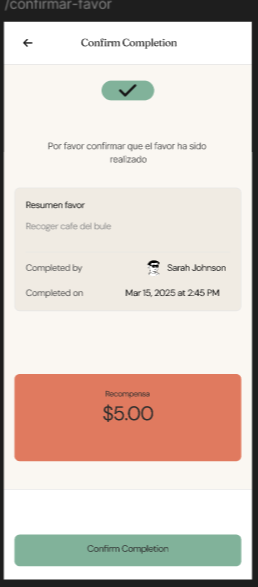
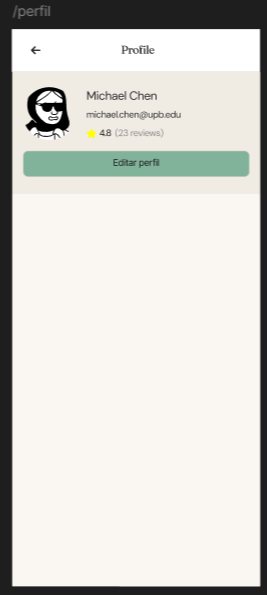

## Wireframes
[Figma - Flujo](https://www.figma.com/design/B3BCN2iu4j3visEaD7vHdr/Dise%C3%B1os-UX---UI?node-id=0-1&p=f&t=B35rh2fDxt58N2aw-0)

## Inicio de sesion (Login)

## Registro de Usuario

                
## Pantalla Principal(Home)

## Detalles del Favor

## Crear Solicitud de Favor

## Chat

## Favor en Progreso

## Confirmación de Favor

## Calificacion

## Perfil

